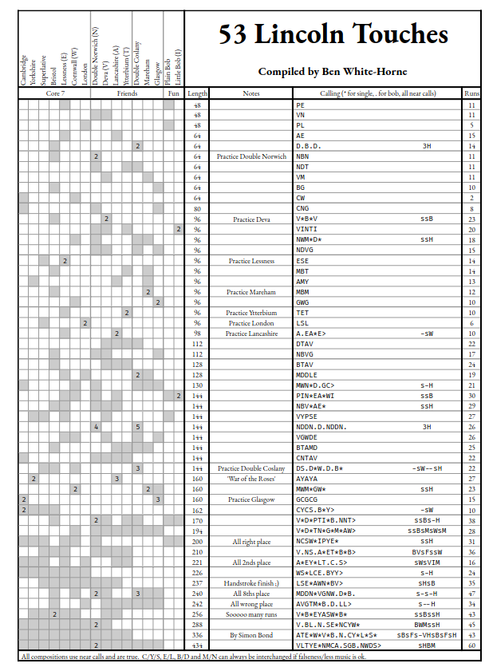

# Practice Night Spliced Sheet Generator

This repository contains a Python script which generates a spreadsheet of practice night touches (a "touch" is the name for a short "piece"
of church bell ringing).  It generates Excel spreadsheet files which succinctly summarise the touches like the following:



It is not intended to be generally usable - I use it to generate touches for the practice at Lincoln College, Oxford.  But if you do want
to run it, you can generate the above screenshot as follows:

```bash
pip install openpyxl
./run.py examples/lincoln-2022 Lincoln.xls
```
